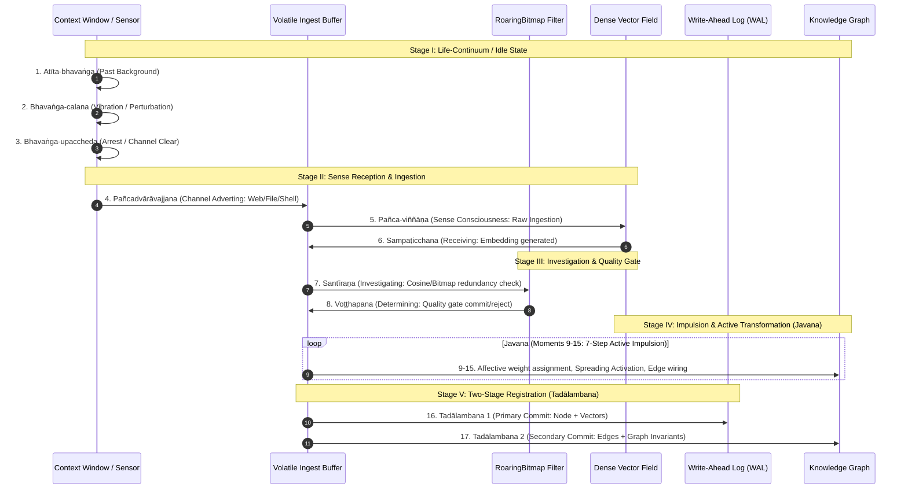

# The Abhidharma Thermodynamic Memory Model: Mathematical and Computational Architecture

**Document Version:** 1.0.0  
**Domain:** Cognitive Computing, Computational Buddhist Psychology, Non-Equilibrium Statistical Mechanics  
**Reference System:** Ferricula / Ferricula v2  

---

## 1. Philosophical and Theoretical Foundations

Standard artificial intelligence memory architectures (vector databases like Pinecone, Qdrant, Milvus, and naive RAG pipelines) treat memory as an **immutable, passive archive**. Information written to disk remains static indefinitely, retrieved solely based on geometric proximity (cosine similarity) without any concept of time, mental state, emotional coloration, or organic decay. This produces:
1. **Context Window Dilution:** Inevitable accumulation of stale, contradictory, and low-utility facts.
2. **Attention Thrashing:** Inability of the LLM attention mechanism to distinguish between what matters *now* versus what was briefly relevant turns ago.
3. **Absence of Synthetic Subjectivity:** The agent lacks a lived history; it cannot form an identity grounded in what it has attended to and what it has forgotten.

Ferricula models memory as a **dynamic, metabolic, thermodynamic process** grounded in the canonical **Theravāda Abhidharma** (systematized in the *Abhidhamma Piṭaka* and Ācariya Anuruddha's *Abhidhammattha Saṅgaha*). In Buddhist phenomenology:
- **Anicca (Impermanence):** Decay is the default state of all conditioned phenomena (*saṅkhāra*). Retention requires metabolic work.
- **Phassa (Contact):** The momentary convergence of sense organ, sense object, and consciousness that initiates memory formation.
- **Vedanā (Feeling-Tone):** The affective valence (pleasant, unpleasant, neutral) that acts as an exponential multiplier on consolidation.
- **Āsava (Taints / Latent Memory Residue):** Historical traces that continuously condition and edit incoming perception.
- **Anattā (Non-Self):** The agent possesses no immutable "soul" or permanent core variable; identity is an emergent property arising from the thermodynamic history of the memory substrate.

---

## 2. The 17-Moment Citta-Vīthi Cognitive State Machine

In the Abhidharma analysis of sensory cognitive processing for a "very great object" (*atimahanta-ārammaṇa*), perception unfolds over precisely **17 thought-moments** (*citta-kshaṇa*). Ferricula translates this discrete-time sequence into a deterministic computational pipeline:



### 2.1 Formal Step-by-Step Computational Mapping

| Moment | Pāli Term | Functional Definition in Abhidhamma | Ferricula Engineering Homology |
|---|---|---|---|
| **1** | **Atīta-bhavaṅga** | Past life-continuum; baseline resting state. | Idle engine state; clock thread tracking UTC and radio entropy reservoir. |
| **2** | **Bhavaṅga-calana** | Vibration of the life-continuum upon stimulus arrival. | Sensor detects raw input packet on Unix domain socket or HTTP stream. |
| **3** | **Bhavaṅga-upaccheda** | Arrest of the stream; disconnection from previous state. | Context window cleared; thread synchronizes for incoming request. |
| **4** | **Pañcadvārāvajjana** | Five-door advertence; attention shifts to sense door. | Dispatcher routes request to appropriate sensory channel (`hearing`, `seeing`, `thinking`). |
| **5** | **Pañca-viññāṇa** | Sense consciousness (e.g. *cakkhu-viññāṇa* = visual). | Raw byte extraction and initial text tokenization. |
| **6** | **Sampaṭicchana** | Receiving the sensory data. | Dense vector generation via embedding microservice (`Shivvr` / GTR-T5 / Qwen3). |
| **7** | **Santīraṇa** | Investigating the object; assessing properties. | Fast candidate scan: RoaringBitmap tag intersection and initial cosine check. |
| **8** | **Voṭṭhapana** | Determining the object; deciding classification. | **Quality Gate:** If incoming vector similarity $> 0.92$ to an existing memory, short-circuit to prevent entropy duplication. |
| **9–15** | **Javana (7 moments)** | Active cognitive processing, intention, and karma (*kamma*). | **Active Processing:** Seven-pass update: assigning affective tags, updating graph edges, setting initial decay rate $\alpha_0$. |
| **16** | **Tadālambana (1)** | Retention / registration phase 1. | **Stage 1 Commit:** Append length-prefixed postcard binary record to the WAL. |
| **17** | **Tadālambana (2)** | Retention / registration phase 2; closing transaction. | **Stage 2 Commit:** Update in-memory index, bit-sliced Roaring bitmaps, and flush transaction. |

---

## 3. The Thermodynamic Decay and Lifecycle Equations

### 3.1 Exponential Fidelity Decay
Every non-keystone memory node $m_i$ possesses an instantaneous fidelity scalar $f_i(t) \in [0.0, 1.0]$. The decay of fidelity across time ticks $\Delta t$ is governed by:

$$f_i(t + \Delta t) = f_i(t) \cdot \exp(-\alpha_{\text{eff}}(i) \cdot \Delta t)$$

Where:
- $\alpha_{\text{eff}}(i)$ is the **effective decay coefficient** for memory $i$.
- $\Delta t$ is measured in logical clock ticks (synchronized with radio entropy pulses).

### 3.2 Adaptive Alpha and Long-Term Potentiation
To simulate long-term memory stabilization through consolidation, the effective decay rate decays logarithmically with the memory's consolidation depth $d_i$:

$$\alpha_{\text{eff}}(i) = \frac{\alpha_0(\text{channel})}{1 + \ln(1 + d_i)}$$

Where:
- $d_i \in \mathbb{N}_0$ represents the number of dream consolidation cycles memory $i$ has survived.
- As $d_i \to \infty$, $\alpha_{\text{eff}} \to \alpha_{\min}$ (bounded lower limit: $0.001$).
- Bounded upper limit: $\alpha_{\max} = 0.020$.

### 3.3 Sensory Channel Parameters

| Channel | Initial Decay ($\alpha_0$) | Keystone Default | Operational Semantics |
|---|---|---|---|
| **`hearing`** | $0.010$ | `false` | External dialogue turns, user prompts, network inputs. |
| **`seeing`** | $0.010$ | `true` | File observations, code inspections, system documentation. |
| **`thinking`** | $0.015$ | `false` | Internal reflections, speculative chain-of-thought, working scratchpad. |

### 3.4 Reinforcement and Neglect Dynamics
Memory dynamics are non-linear and feedback-driven:
1. **Recall Potentiation:** When memory $m_i$ is surfaced and referenced during a recall pass:
   $$\alpha_i \leftarrow \max(\alpha_{\min}, \alpha_i \times 0.95)$$
   $$f_i \leftarrow \min(1.0, f_i + 0.10)$$
2. **Neglect Decay:** When memory $m_i$ remains unreferenced during a dream cycle:
   $$\alpha_i \leftarrow \min(\alpha_{\max}, \alpha_i \times 1.005)$$
3. **Irreversible Lifecycle Transitions:**
   - $f_i \ge 0.75$: **Active** (Fully searchable, participates in all recall passes).
   - $0.25 \le f_i < 0.75$: **Forgiven** (Excluded from standard cognitive recall; accessible only via deep introspective queries).
   - $f_i < 0.25$: **Archived** (Slated for permanent garbage collection or ghost-echo extraction).

---

## 4. The Metabolic Dream Cycle: Entropy and Consolidation

The dream cycle is the autonomous maintenance phase of the memory system, executed asynchronously to preserve cognitive stability without blocking real-time agent execution.

```
       [ Physical SDR Radio ]
                 │
                 ▼ (FM / VHF noise)
       [ Entropy Reservoir ]
                 │ (Threshold >= 16 bytes)
                 ▼
       ┌───────────────────────────────┐
       │      DREAM CYCLE PIPELINE     │
       ├───────────────────────────────┤
       │ 1. Stochastic Decay Filter    │ ── Bitwise masking via entropy seed
       │ 2. Forgiveness Transition     │ ── Move f < 0.75 to Forgiven
       │ 3. Centroid Consolidation     │ ── Merge cosine >= 0.85 into centroids
       │ 4. Neglect Acceleration       │ ── Increase alpha on unread nodes
       │ 5. Keystone Audit             │ ── Verify immutable reference nodes
       │ 6. Vec2Text Inversion         │ ── Extract Ghost Echoes from dying vectors
       └───────────────────────────────┘
```

### 4.1 Physical Entropy Harvesting
Rather than utilizing pseudo-random number generators, Ferricula harvests physical entropy from an RTL-SDR software-defined radio tuning into environmental background noise (open marine VHF channels or inter-station FM hiss).
- Entropy accumulates in a local byte reservoir.
- When the reservoir exceeds 16 bytes, it triggers a `DreamTrigger` event with intensity $I \in [0.0, 1.0]$ proportional to reservoir volume.
- **Stochastic Decay Filtering:** A memory node $i$ is evaluated for decay only if:
  $$\text{Seed}[i \pmod n] < \lfloor 255 \cdot I \rfloor$$
  This ensures forgetting is non-deterministic and physically coupled to environmental fluctuations.

### 4.2 Semantic Consolidation via Weighted Centroids
During phase 3 of the dream, pairwise cosine similarity is evaluated across all active memory vectors:
- For any cluster $C = \{m_1, m_2, \dots, m_k\}$ where $\forall i,j: \cos(v_i, v_j) \ge 0.85$:
  The cluster is merged into a single consolidated memory $m^*$:
  $$v^* = \frac{\sum_{j=1}^k f_j \cdot v_j}{\left\| \sum_{j=1}^k f_j \cdot v_j \right\|}$$
- The new consolidation depth is updated: $d^* = \max(d_j) + 1$.
- Graph edges attached to all ancestor nodes are consolidated and re-pointed to $m^*$, with edge weights summed and normalized.
- Ancestor nodes are marked as merged and archived.

### 4.3 The Ghost Echo: Final Vector Inversion
When a memory's fidelity approaches terminal collapse ($f_i < 0.10$), rather than abruptly deleting the record, Ferricula executes **vec2text inversion** using an ONNX-runtime hypothesis-and-corrector pipeline:
1. **Hypothesis Generation:** A sequence-to-sequence model produces candidate text $T_0$ from vector $v_i$.
2. **Iterative Correction:** Re-embed $T_0 \to v(T_0)$, calculate residual $\Delta v = v_i - v(T_0)$, and refine text.
3. **Ghost Edge Attachment:** If round-trip cosine similarity exceeds $0.50$, the distilled textual gist is preserved as a lightweight "ghost echo" edge ($w = 0.10$) attached to its nearest topological neighbors in the knowledge graph. The dense vector is then dropped, saving 99% of storage while retaining semantic trace.

---

## 5. Resonant Recall and Wheeler-Feynman Absorber Physics

In Ferricula v0.6.0+, recall was upgraded from passive nearest-neighbor ranking to **resonant recall**, an energy-based transaction inspired by the **Wheeler-Feynman Absorber Theory**:
- An agent emitting a query acts as an **emitter** broadcasting an offer wave into the memory field.
- Memories act as **absorbers**, determining whether to respond based on their internal thermodynamic state.
- Five **Wisdom King (*Myōō*) Resonance Gates** filter candidate memories:
  1. **Fudō-Myōō Gate (Fidelity):** Blocks memories with $f_i < \theta_f$.
  2. **Gōzanze-Myōō Gate (Lifecycle):** Rejects decayed or archived states.
  3. **Gundari-Myōō Gate (Temporal Coherence):** Requires temporal alignment with the current narrative arc.
  4. **Kongōyasha-Myōō Gate (Cognitive Heat):** The agent accumulates cognitive "heat" $H$ on each retrieval. When heat exceeds threshold $H_{\text{crit}}$, this gate clamps retrieval to prevent context thrashing.
  5. **Daiitoku-Myōō Gate (Craft / Load Governance):** In v0.9.0, checks cognitive load score. When the system detects *vicikicchā* (Abhidharma perplexity—where current memory cannot resolve the goal), it blocks raw injection and escalates to deep reasoning models.
