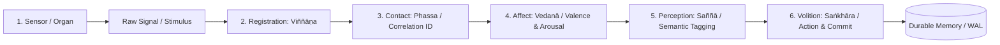

# Sense-Doors, Affect Dynamics, and Situated Awareness in Artificial Mind Architecture

## 1. Executive Summary & Epistemic Grounding

In Kord Campbell's Lucidworks Activate address (*Self-Aware Machines: From Logs to Living Systems*) and the foundational Abhidharma phenomenological treatises (such as the *Dhammasaṅgaṇī* and Bhikkhu Bodhi’s *Comprehensive Manual of Abhidhamma*), cognition is analyzed not as an isolated, prompt-driven text transformer, but as a **situated, sensory-grounded causal process**.

Current LLM agent frameworks suffer from a severe architectural delusion: they operate as a **"brain in a jar"**—stateless function invocations that wake up only when prompted by a human user, process a frozen token batch, and vanish. They possess:
1. **Zero continuous situated awareness:** They cannot differentiate between a live environmental observation and a historical replayed log.
2. **Global lock serialization:** Naive multi-modal agents serialize all sensory modalities (text, vision, audio, telemetry) into a single synchronous loop, causing catastrophic latency stalls whenever an edge sensor delays.
3. **Absence of homeostatic affect:** They lack an internal affective state (valence, arousal) to dynamically modulate attention priority, search budget, and memory decay.
4. **The Multiple-Personality Trap:** Naive cognitive designs spawn conflicting autonomous sub-agents with competing command authorities ("inner voices"), fracturing system coherence.

This document formalizes the engineering blueprint for **Situated Awareness**, **Concurrent Sense-Door Channels**, **Time-Varying Affect Modulation**, and the **"Empty Throne" Single-Writer Identity** in Ferricula and Lume.

---

## 2. The Sense-Door Chain: From Stimulus to Action

In Abhidharma phenomenology and Kord Campbell's formulation, perception unfolds along a strict six-stage functional causal chain (*Sense-Door Process*):

$$\text{Organ } (\text{Indriya}) + \text{Object } (\bar{A}) \xrightarrow{} \text{Viññāṇa} \xrightarrow{} \text{Phassa} \xrightarrow{} \text{Vedanā} \xrightarrow{} \text{Saññā} \xrightarrow{} \text{Saṅkhāra}$$

```
+---------------------------------------------------------------------------------------------------+
|                                     THE SENSE-DOOR PROCESS                                        |
+------------------------------------+--------------------------------------------------------------+
| 1. Organ + Object                  | Physical sensor faculty + Environmental stimulus             |
| 2. Viññāṇa (Registration)          | Raw modality capture & edge tensor projection                |
| 3. Phassa (Contact / Binding)      | Event synchronization & multi-channel correlation ID binding  |
| 4. Vedanā (Affective Appraisal)    | Valence (+/0/-) and arousal valuation; urgency assignment    |
| 5. Saññā (Perceptual Recognition)  | Conceptual classification, tag assignment, & prototype match |
| 6. Saṅkhāra (Volitional Formation) | Executive decision, goal updating, & tool call dispatch      |
+------------------------------------+--------------------------------------------------------------+
```



### 2.1 Concrete Operational Semantics
1. **Sensor / Organ (`Indriya`):** Dedicated physical or OS interface (e.g., Linux socket, file watcher, camera frame grabber, audio stream, system telemetry).
2. **Registration (`Viññāṇa`):** The raw signal is captured asynchronously by a modality-specific worker. It yields a raw observation token or tensor without performing high-level semantic interpretation.
3. **Contact (`Phassa`):** The observation is bound to an `EpisodeCorrelationId`. It records the exact wall-clock observation timestamp $t_{\text{obs}}$, source device identifier, and spatial/context coordinates.
4. **Affective Appraisal (`Vedanā`):** The system computes an initial valence score $\nu \in [-1.0, 1.0]$ and arousal intensity $\alpha_{\text{arousal}} \in [0.0, 1.0]$. A sudden unexpected kernel panic or physical obstacle yields high arousal and negative valence; a routine file modification yields low arousal and neutral valence.
5. **Perceptual Recognition (`Saññā`):** Fast candidate classification using Lume FST taggers, BM25 keyword matching, or contrastive embedding lookup (SigLIP / GTR-T5). Attaches descriptive labels and links to existing conceptual attractors.
6. **Volitional Formation (`Saṅkhāra`):** If the event requires action, the executive engine updates active goals, allocates token compute budget, and issues structured tool invocations.

---

## 3. Concurrent Sense-Doors Without Global Serialization

### 3.1 The Multi-Rate Sensor Problem
Real-world systems operate at wildly disparate temporal frequencies:
- **Telemetry / System Metrics:** 100 Hz – 1 kHz (microsecond latency).
- **Audio Transients / Speech:** 16 kHz sample rate, chunked at 100 ms – 1.0 s intervals.
- **Vision / Camera Frames:** 10 – 60 Hz (30–100 ms latency).
- **Text / Document Ingestion:** Burst events taking 500 ms – 5.0 s per document.

If an AI agent blocks its main reasoning loop on synchronous sensory input, the entire cognitive stream freezes whenever an audio buffer buffers or a PDF renders.

### 3.2 Asynchronous Ingress Architecture
Ferricula decouples sensory ingestion into concurrent worker channels operating over bounded lock-free ring buffers, converging at an **Episode Aggregator**:

```
[ Vision Channel (SigLIP) ]    ----(Frame Token + t1)----\
[ Audio Channel (CLAP) ]       ----(Event Token + t2)-----> [ Episode Aggregator ] 
[ Telemetry Channel (sysfs) ]  ----(State Vector + t3)---/   (Binds via Correlation ID)
[ Text / Shell Channel (pty) ] ----(Log Line     + t4)--/             |
                                                                       v
                                                             [ Situated State Buffer ]
                                                                       |
                                                                       v
                                                             [ Single-Writer Engine ]
```

### 3.3 Data Structures: Asynchronous Observation Envelope
```rust
#[derive(Debug, Clone, Serialize, Deserialize)]
pub struct SensoryObservation {
    pub correlation_id: u128,
    pub channel: SenseChannel,
    pub timestamp_observed: u64,
    pub payload: ObservationPayload,
    pub preliminary_affect: AffectVector,
    pub confidence: f32,
}

#[derive(Debug, Clone, Copy, PartialEq, Eq, Serialize, Deserialize)]
pub enum SenseChannel {
    Visual,
    Acoustic,
    TactileTelemetry,
    LinguisticDialogue,
    DocumentPlane,
}

#[derive(Debug, Clone, Serialize, Deserialize)]
pub struct AffectVector {
    /// Valence: -1.0 (painful/erroneous) to +1.0 (satisfying/aligned)
    pub valence: f32,
    /// Arousal: 0.0 (quiescent/background) to 1.0 (urgent/critical)
    pub arousal: f32,
}
```

**Key Invariant:** Missing channels do **not** stall the pipeline. If an acoustic clatter occurs with no visual corroboration, the episode is committed with `visual: None, acoustic: Some(...)`, preserving the observation truthfully without synthesizing fictional data.

---

## 4. Dynamic Affect Engine: Homeostatic Modulation of Cognition

In human cognition (as emphasized in Kord Campbell's lecture on nervousness and focus), affect is not a decorative sentiment label; it is a **meta-parameter control system** that dynamically tunes cognitive resource allocation:

$$\text{Affect State: } \mathbf{a}(t) = (\nu(t), \gamma(t)) \quad \text{where} \quad \nu = \text{Valence}, \; \gamma = \text{Arousal}$$

### 4.1 Affective Control Rules for Memory & Retrieval

| Cognitive Parameter | Affective Dependency | Functional Effect in System |
|---|---|---|
| **Retrieval Temperature ($T_{\text{search}}$)** | $T(t) = T_0 \cdot (1 - 0.5 \cdot \gamma(t))$ | High arousal **narrows the attentional beam**, sharpening focus on high-confidence exact matches; low arousal **broadens retrieval**, encouraging associative exploration. |
| **Candidate Retrieval Budget ($K_{\text{topk}}$)** | $K(t) = K_0 \cdot (1 + \gamma(t))$ | High arousal expands the candidate pool to ensure critical danger or emergency procedures are not missed. |
| **Memory Consolidation Threshold ($\theta_{\text{consolidate}}$)** | $\theta(t) = \theta_0 - \lambda \cdot |\nu(t)|$ | High emotional valence (either extreme success or severe failure) **lowers the write threshold**, engraving high-impact memories deeply into long-term storage. |
| **Thermodynamic Decay Rate ($\alpha_{\text{decay}}$)** | $\alpha_{\text{eff}} = \alpha_0 \cdot \exp(-\mu \cdot \gamma \cdot \mathbb{I}(\nu > 0))$ | Successful high-arousal experiences experience drastically slowed decay, becoming durable heuristics. |

**Strict Isolation Invariant:** Affect modulates **allocation policies and search parameters**, but **never rewrites underlying evidence**. A file was modified at 04:32:00 UTC regardless of whether the agent was calm or alarmed. Historical audit trails remain objective and immutable.

---

## 5. The "Empty Throne": Single-Writer Trajectory Identity

### 5.1 The Anti-Pattern: The Disjoint Swarm
A prevalent misconception in agent design is constructing multiple competing "inner voices" (e.g., a "critic agent", a "planner agent", a "safety agent", an "executor agent") that engage in continuous, uncoordinated text chat behind the scenes. This leads to:
- Quadratic token cost explosion.
- Irreproducible race conditions.
- Diffuse responsibility with no single point of failure or audit.

### 5.2 The Unified Situated Agent
As formulated in the "Empty Throne" architecture:
> **The throne of executive decision is empty of a permanent metaphysical self (Anattā), yet must possess exactly one authoritative decision boundary.**

1. **Sub-Modules are Advisory:** Semantic search, FST taggers, and dense vector retrievers are passive advisory functions. They return candidate projections and confidence scores.
2. **Single Commit Loop:** Exactly one authoritative state transition loop (the Server Commit Coordinator) validates proposals against current engine revisions and serializes writes to the Write-Ahead Log (WAL).
3. **Identity as a Trajectory:**
   $$\text{Identity}(t) = \left( \text{CoreConfig}, \; \mathcal{H}_t = \{(s_\tau, a_\tau, o_\tau, \kappa_\tau)\}_{\tau=0}^t \right)$$
   An agent's identity is not a static 50-line prompt template. It is the **continuous, replayable historical trajectory of its observations, choices, environmental commitments, and causal efficacy feedback**.

---

## 6. Engineering Roadmap for Ferricula + Lume

1. **Phase 1: Situated Context Projection (`ferricula-server`):**
   Expose an active situational state buffer containing:
   - Current active goal and sub-task stack.
   - Recent environmental sensor telemetry (host CPU, RAM, disk, network socket events).
   - Timestamp of last user/external interaction.
   - Unresolved observation buffer (recent anomalous sensory events awaiting explanation).
2. **Phase 2: Affect-Modulated Retrieval Search (`ferricula-search`):**
   Connect runtime arousal $\gamma(t)$ to Lume’s hybrid retrieval parameters ($\alpha_{\text{blend}}$, roaring candidate pruning threshold, and top-k cutoff).
3. **Phase 3: Multi-Rate Sensory Ingress Buffer:**
   Implement non-blocking sensory ingestion channels feeding into `EpisodeCorrelationId` structures, enabling seamless binding of text, screenshots, and system telemetry without thread starvation.
