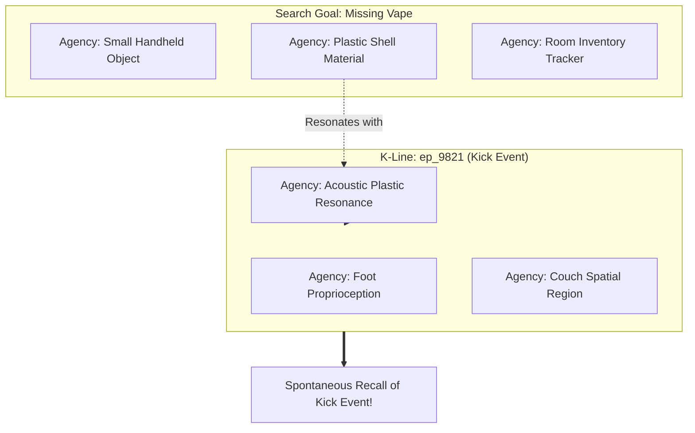

# Cross-Modal Audio Representation, Unresolved Observations, and Minsky K-Lines

## 1. Executive Summary & Problem Formulation

In `research/architecture.md §10`, the human user provided a central motivating cognitive scenario:
> While preparing to take remodeling waste to the dump, an individual kicked something near a couch and heard a distinct, plastic-like clatter. The immediate visible items (a robe and a foam roller) did not explain the acoustic transient. An immediate search under the couch yielded nothing. Twenty minutes and several intervening tasks later, an active search for a missing vape suddenly cued the earlier clatter. A subsequent targeted search located the vape in a distant corner of the room, confirming that it had been kicked across the floor.

This scenario exposes three fundamental architectural failure modes in standard AI memory systems:
1. **The Nearest-Neighbor Deterministic Trap:** Standard vector retrieval ($k$-NN on cosine similarity) queries only points that are semantically close to the current goal (`vape` $\to$ tables, pockets, charging stands). It completely fails to retrieve an acoustic anomaly (`clatter near couch`) because their embedding representations reside in disparate semantic neighborhoods.
2. **The Multimodal Audio Void (SigLIP Gap):** Contemporary state-of-the-art multimodal encoders like **SigLIP 2** connect text and visual modalities ($\mathcal{T} \times \mathcal{I} \to \mathbb{R}^d$), but possess **zero acoustic representation capabilities**. A non-speech acoustic transient cannot be ingested into a SigLIP vector index.
3. **Premature Eviction of Unresolved Anomalies:** Standard memory lifecycles either immediately discard unclassified sensory noise or force an incorrect, low-cost classification ($H_0$: "kicked baseboard"), which is then frozen as a false fact.

This document formalizes the architectural solution: **Cross-Modal Acoustic Models (CLAP)**, the **Unresolved Episode Engine**, and **Minsky K-Line State Reactivation**.

---

## 2. Resolving the Acoustic Multimodal Gap

```
+----------------------------------------------------------------------------------------------------+
|                                ACOUSTIC INGESTION ARCHITECTURES                                    |
+----------------------+------------------------------------+----------------------------------------+
| Model / Pipeline     | Mechanism & Modality Space         | Suitability for Ferricula / Lume       |
+----------------------+------------------------------------+----------------------------------------+
| **LAION-CLAP /**     | Dual-encoder contrastive space:    | **PRIMARY MULTIMODAL CANDIDATE:**      |
| **Microsoft CLAP**   | $\text{Audio} \times \text{Text}   | Directly maps raw acoustic transients  |
|                      | \to \mathbb{R}^{512}$              | to natural language descriptions.      |
|                      |                                    | Enables text queries to find sounds.   |
+----------------------+------------------------------------+----------------------------------------+
| **AudioMAE / AST**   | Self-supervised spectrogram        | High acoustic classification accuracy, |
|                      | masked autoencoders                | but requires secondary projection      |
|                      |                                    | head to align with text or vision.     |
+----------------------+------------------------------------+----------------------------------------+
| **Symbolic Acoustic**| Specialized edge detector          | **IMMEDIATE NO-ML BACKUP PATH:**       |
| **Transliteration**  | + Audio-to-text prompt pipeline   | Emits attributed descriptive tokens   |
|                      | (`[Acoustic: sharp plastic clatter]`) into existing Lume BM25 + SigLIP.    |
+----------------------+------------------------------------+----------------------------------------+
```

### 2.1 The Contrastive Language-Audio Pretraining (CLAP) Solution
To give an artificial mind true hearing without breaking vector-space isolation:
- **CLAP Model Architecture (Elizalde et al., 2023; Microsoft 2023):**
  Uses an Audio Spectrogram Transformer (AST / HTS-AT) paired with a text encoder (RoBERTa or BERT), trained with InfoNCE contrastive loss over audio-caption pairs (LAION-Audio-630K).
- **Mathematical Projection:**
  $$\mathbf{z}_{\text{audio}} = \frac{f_{\text{audio}}(\mathbf{X}_{\text{spectrogram}})}{\|f_{\text{audio}}(\mathbf{X}_{\text{spectrogram}})\|}, \quad \mathbf{z}_{\text{text}} = \frac{f_{\text{text}}(\mathbf{T})}{\|f_{\text{text}}(\mathbf{T})\|}$$
- **Cross-Modal Query Capability:**
  An agent querying `"plastic impact sound on hard surface"` computes cosine similarity directly against stored acoustic vectors $\mathbf{z}_{\text{audio}}$ without needing manual human transcription!

### 2.2 Storage Bank Isolation Contract
In accordance with `research/architecture.md §2` and Added Armadillo’s `engine-orders.md`:
- CLAP vectors reside in a dedicated vector bank: `EmbeddingSpaceId(3)` (`CLAP_AUDIO_512`).
- **Invariant:** CLAP vectors are never mixed or compared directly with SigLIP 2 vectors (`EmbeddingSpaceId(1)`) or GTR-T5 vectors (`EmbeddingSpaceId(0)`). Cross-modal associations are mediated at the **Episode Graph level**, not through cross-space Euclidean operations.

---

## 3. The Unresolved Episode Engine: Architecture & Lifecycle

```
[ Time t0: Sensory Ingress ]
  ├── Foot motion near couch (Proprioceptive)
  └── Sharp plastic clatter (Acoustic: CLAP z_audio)
         │
         ▼
[ Immediate Local Assessment ]
  ├── Visually inspect couch perimeter: [Robe, Foam Roller]
  ├── Explanation test: Does robe/roller explain clatter? -> NO
  └── Search under couch: Target not found -> Status: UNRESOLVED
         │
         ▼
[ Instantiate UnresolvedEpisode ]
  ├── ID: ep_9821
  ├── Timestamp: 2026-09-19 14:15:00 UTC
  ├── Modality: Acoustic + Spatial
  ├── Raw Evidence: acoustic_vector_hash, spatial_node_couch
  ├── Status: HypothesisPending
  ├── Active Allowance: 2 hours (exempt from early pruning)
  └── Candidate Explanations: [H0: "unknown hard plastic object kicked"]
         │
         · (20 minutes pass: agent washes dishes, carries boxes)
         · (Passive decay operates, but ep_9821 is protected)
         ·
         ▼
[ Time t1: Active Goal Shift ]
  ├── Human User / Agent Goal: "Where is my vape?"
  ├── Target Properties: [plastic body, small, easily dropped]
  ├── K-Line Activation: "plastic" + "room floor" energizes ep_9821
  └── Association Spike: ep_9821 surfaced as High-Relevance Candidate!
         │
         ▼
[ Targeted Search Execution ]
  ├── Trajectory Calculation: Kick momentum -> distant corner
  ├── Visual confirmation: Vape located in corner!
  └── Causal Commit: Resolve ep_9821 -> Edge: CausalDisplacement(Vape)
```

### 3.1 Data Structure Specification: `UnresolvedEpisode`
```rust
#[derive(Debug, Clone, Serialize, Deserialize)]
pub struct UnresolvedEpisode {
    pub episode_id: u64,
    pub observation_time: u64,
    pub location_context: Option<String>,
    pub sensor_evidence: Vec<SensorEvidenceRef>,
    pub candidate_hypotheses: Vec<Hypothesis>,
    pub failed_inspections: Vec<InspectionRecord>,
    pub retention_budget_remaining: u32,
    pub state: UnresolvedState,
}

#[derive(Debug, Clone, Serialize, Deserialize)]
pub enum UnresolvedState {
    HypothesisPending,
    PartiallyExplained { leading_hypothesis: String, confidence: f32 },
    Resolved { confirmed_fact_id: u32, resolution_time: u64 },
    RetiredUnexplained { reason: RetirementReason },
}
```

### 3.2 Key Operational Rules
1. **Observation vs. Interpretation Separation:** An unresolved observation records *what was measured* (a 1.2 kHz transient impact with 0.82 plastic resonance), strictly separate from *what it is believed to be*.
2. **Protected Retention Budget:** Newly created unresolved episodes receive a dedicated policy allowance (e.g., 2 hours wall-clock or 50 cognitive cycles) during which they are protected from thermodynamic eviction or cosine merging, ensuring that delayed cues have time to arrive.
3. **Negative Evidence Boundary:** "Not seen in the 2-meter radius inspected under the couch" is recorded as a bounded spatial negative constraint, preventing premature closure of the investigation.

---

## 4. Minsky’s K-Lines: Sparse Mental State Reactivation

In Marvin Minsky's *The Society of Mind* (Section 8.1: "K-Lines: A Theory of Memory"), memory retrieval does not copy dense proposition lists into a centralized CPU. Instead, a **K-line** is a mental connection wire that reactivates the specific cognitive agencies that were active during the original event.

### 4.1 Computational Formulation of K-Lines
Let $\mathcal{A} = \{a_1, a_2, \dots, a_N\}$ be the set of perceptual and cognitive feature extractors in the system (e.g., color detector, material resonance analyzer, room region tracker, motion direction detector).

A K-line $K_e$ created at episode $e$ is a sparse binary vector over agencies:
$$K_e = \{ a_i \in \mathcal{A} : a_i \text{ was active at } t_{\text{event}} \}$$



### 4.2 Escaping the Nearest-Neighbor Trap via Stochastic Annealing
Standard deterministic search computes $\text{argmax}_j \cos(\mathbf{q}_{\text{vape}}, \mathbf{k}_j)$, which is trapped in standard vape resting locations.

To escape this trap, the retrieval Hamiltonian incorporates a thermal perturbation parameter $\beta = 1/T$:

$$P(\text{Retrieve } j) = \frac{\exp\left( \beta \cdot \left[ \cos(\mathbf{q}, \mathbf{k}_j) + W_{\text{K-line}}(j) + W_{\text{unresolved}}(j) \right] \right)}{\sum_m \exp\left( \beta \cdot \left[ \cos(\mathbf{q}, \mathbf{k}_m) + W_{\text{K-line}}(m) + W_{\text{unresolved}}(m) \right] \right)}$$

- At moderate temperatures ($T > 0$), the bonus weight $W_{\text{unresolved}}(j)$ and K-line material resonance ($W_{\text{K-line}}(j)$) elevate the dormant clatter episode above the noise floor.
- The agent "remembers" the kick not through brute-force linear scanning, but because **the material and spatial attributes of the new goal re-energized the dormant K-line**.

---

## 5. Architectural Synthesis: The Full Resolution Workflow

```
+----------------------------------------------------------------------------------------------------+
|                                    EPISODIC RESOLUTION PIPELINE                                    |
+----------------------------------------------------------------------------------------------------+
| 1. Observation Ingress     | Sensor streams record acoustic transient + spatial context.           |
| 2. Anomaly Tagging         | Visible items fail explanation check -> Enters UnresolvedEpisode store.|
| 3. K-Line Attachment       | Sparse link binds foot-motion, couch-location, and acoustic signature. |
| 4. Protected Incubation    | Memory decays slowly; remains eligible for cross-modal queries.        |
| 5. Delayed Goal Alignment  | User prompts: "Where is my vape?" -> Activates plastic/object agencies.|
| 6. K-Line Resonance        | Shared material/spatial features fire -> Clatter episode recalled.     |
| 7. Causal Reinterpretation | Free energy minimization: Clatter = Vape impact trajectory.           |
| 8. Grounded Verification   | User/agent checks distant corner -> Vape verified and recovered!      |
| 9. Durable Graph Update    | State changes: Unresolved -> Resolved. Causal edge committed to WAL.  |
+----------------------------------------------------------------------------------------------------+
```

By formalizing cross-modal acoustic representations (CLAP), protected unresolved episode caches, and Minsky K-line associative reactivation, Ferricula and Lume bridge the critical divide between static document indexing and living, situated causal intelligence.
