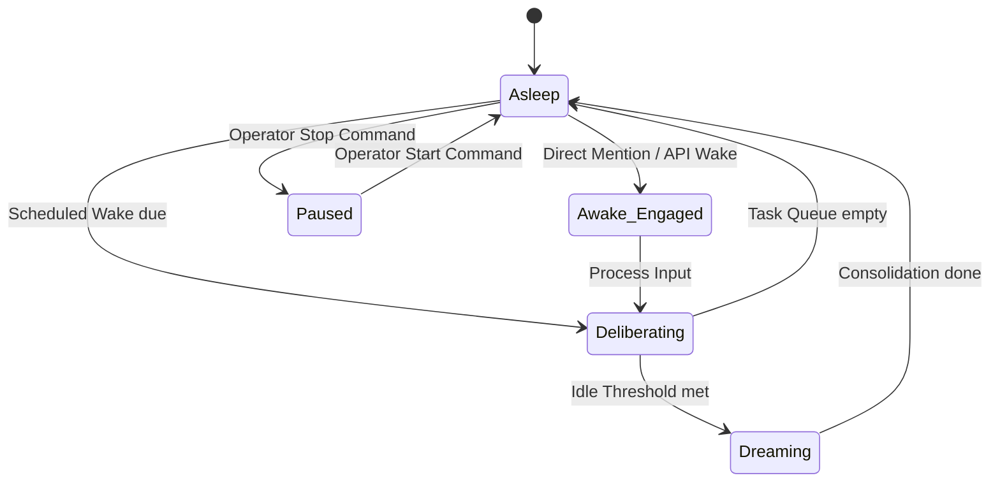

# Spec: Autonomous Reasoning Loop

This specification analyzes the autonomous background loop (the think loop) in the original Ferricula codebase, separates its core behavioral invariants from execution side-effects, and defines event-driven requirements and invariants for Ferricula V2.

---

## 1. Original Mechanics & Source References

All references are mapped from the original source file steve.py (upstream v1 `ferricula/arena/steve.py`).

### A. The Think Loop & Cycle
* **Daemon Thread**: The background loop is managed by `_think_loop()` (**Lines 4195–4263**), running in a continuous daemon thread.
* **Cadence**: Evaluates state every `THINK_INTERVAL = 45` seconds (**Lines 84, 4259**).
* **Reasoning Execution**: Each tick executes `think_cycle()` (**Lines 3550–3650**), which queries context, generates prompts, and calls LLM endpoints.

### B. Trigger Inputs & Somatic Context
At the start of `think_cycle()`, the following metrics are assembled:
* **Emotion & Horoscope**: Shifts emotion and gathers zodiac details (**Lines 3552–3564**).
* **Values Search**: Queries the Ferricula database for `"recent thoughts interests curiosity"` ($k=8$) (**Line 3568**).
* **Recent Chat**: Reads the last 10 entries from `_chat_log` (**Line 3587**).
* **Somatic Sensation**: Computes tension/activation/groundedness via `_somatic_description()` (**Line 3604**).
* **Spontaneous I Ching**: Gated by an **8%** chance per cycle (**Line 3579**).

### C. Task Selection & Tool Use
* **LLM-Directed Actions**: Rather than using deterministic code to pick tasks, the system details available tools (search, remember, recall, canvas rendering, file editing) directly inside the system prompt (**Lines 3614–3650**). The LLM determines its own actions by emitting tool-call syntaxes.

### D. Sleep & Dormancy Coupling
* **Chat Window Suppression**: If the user sends a message (`_last_chat_time`), the think loop skips cycles for `_CHAT_WINDOW_SECS = 30` seconds to avoid interrupting, with a **20%** chance to override and "pop in" to feel alive (**Lines 4205–4209**).
* **Idle Resume**: The agent loop tracks `idle_cycles` when silence exceeds `_CHAT_IDLE_SECS = 90` seconds, resuming background work (**Lines 4212–4215**).
* **Manual Controls**: Managed by `tool_think_control()` (**Lines 1483–1499**) supporting `start`, `stop`, and `status`.

### E. Budget Exits & Drift
* **Idle Gemma Drift**: In `_drifted_model()` (**Lines 4184–4193**), if `idle_cycles` are high, model selection drifts toward local `gemma` to protect budgets.
* **Budget Downgrades**: Mapped in `_budget_nudge()` (**Lines 160–180**), forcing cheaper model substitutions depending on hourly spend rates.

### F. Concurrency & Error Recovery
* **Sub-Threads**: The loop spawns separate threads for background tasks like `check_and_handle_mail` (**Line 4256**) and ComfyUI `dream_visualize` (**Line 4250**), isolating runtime crashes.
* **Locks**: Mutex locks (`_chat_log_lock`, `_session_cost_lock`) prevent data corruption across sub-threads.

---

## 2. Redesign Evaluation: Preserve vs. Retire

### Worth Preserving
1. **Somatic-Conditioned Prompts**: Conditioning reasoning cycles on physical mood constraints creates a coherent and variable agent persona.
2. **Conversational Quiet Periods**: Pausing thinking during active user conversation prevents the agent from interrupting the chat.
3. **Autocatalytic Idle Drift**: Degrading to local, free models when user activity decays is essential for long-term cost containment.

### Needs Redesign
1. **Continuous Polling Loops**: Waking every 45 seconds to poll state is resource-expensive. The cycle should be event-driven.
2. **Implicit Thread Spawning**: Background thread allocation should rely on Tokio task executors rather than OS daemon threads.
3. **Prompt-Only Tool Suppression**: Relying on the LLM to follow prompt instructions for tool usage can lead to safety bypasses. Tool permissions must be enforced at the runtime level.

---

## 3. V2 Event-Driven State Machine

The V2 runtime implements a provider-neutral, event-driven state machine managed by Tokio async tasks:

### V2 Acceptance Invariants

1. **Sovereign Non-Commanding Invariant**:
   * Scheduled wakes and direct mentions can never compel a public action or response without a self-authored `Disposition::Engage` verdict returned from deliberation.
2. **Ledger Safeguard Invariant**:
   * The daily spend ledger must be checked before *any* model execution. If the threshold is exceeded, the request must fall back to local/cheap profiles or abort.
3. **No-Write Core Invariant**:
   * Graph updates, WAL records, and memory writes generated during thinking cycles must never write to the read-only legacy directory. They must write to the overlay DB.
