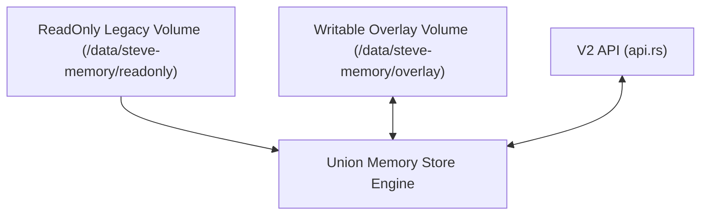

# Spec: Memory Lifecycle & Dream Consolidation System

This specification details the thermodynamic memory mechanics, decay math, consolidation loops, and visual dream triggers in the original Ferricula codebase, and presents a staged design for a write-overlay architecture in Ferricula V2.

---

## 1. Original Mechanics & Source References

### A. Memory Ingestion & Creation
* **Creation Interface**: `tool_remember()` (**Lines 738–759** of steve.py (upstream v1 `ferricula/arena/steve.py`)) creates memories by dispatching text, importance, channel, and keystone markers via a POST to `/remember`.
* **Advocate Writeback**: Values-alignment verdicts generated in `_run_advocate_cycle()` (**Line 4161** of steve.py (upstream v1 `ferricula/arena/steve.py`)) are directly written back to the memory engine as `thinking` channel memories.

### B. Somatic Memory Decay & Reinforcement
* **Decay math**: In `MemoryRecord::decay_tick()` (**Lines 130–137** of memory.rs (upstream v1 `ferricula/src/memory.rs`)), active memories decay exponentially:
  $$\text{fidelity}_{\text{new}} = \text{fidelity}_{\text{old}} \times e^{-\alpha_{\text{eff}}}$$
  * **Effective Alpha**:
    $$\alpha_{\text{eff}} = \frac{\alpha}{1 + \ln(1 + \text{consolidation\_depth})}$$
* **Recall Reinforcement**: In `on_recall()` (**Lines 145–149** of memory.rs (upstream v1 `ferricula/src/memory.rs`)), a memory recall shrinks its decay rate:
  $$\alpha_{\text{new}} = \alpha_{\text{old}} \times 0.95 \quad (\text{bounded to } \alpha_{\text{min}} = 0.001)$$
* **Neglect Growth**: In `on_neglect()` (**Lines 151–154** of memory.rs (upstream v1 `ferricula/src/memory.rs`)), memories stale for >24h (`NEGLECT_SECONDS = 86400`) have their decay rate increased:
  $$\alpha_{\text{new}} = \alpha_{\text{old}} \times 1.005 \quad (\text{bounded to } \alpha_{\text{max}} = 0.02)$$
* **Keystone Proximity (Halo Touch)**: In `on_halo_touch()` (**Lines 162–167** of memory.rs (upstream v1 `ferricula/src/memory.rs`)), non-keystone direct neighbors of keystones receive protection:
  $$\alpha_{\text{new}} = \alpha_{\text{old}} \times 0.99$$

### C. Memory Lifecycle States
* **Active**: Fidelity $\ge$ `FIDELITY_GATE` (0.75). Keystones are immune to decay and always remain Active.
* **Forgiven**: Transitioned from Active in Phase 2 of `dream_cycle` when fidelity drops below 0.75 (**Lines 175–181** of memory.rs (upstream v1 `ferricula/src/memory.rs`)).
* **Archived**: Transitioned from Forgiven in Phase 6 of `dream_cycle` after 1 hour of neglect (**Lines 183–190** of memory.rs (upstream v1 `ferricula/src/memory.rs`)).
* **Pruning**: Archived records with fidelity $< \epsilon$ are deleted (**Lines 282–315** of dream.rs (upstream v1 `ferricula/src/dream.rs`)). Traces are preserved as "ghost echoes" attached to neighboring nodes.

### D. Graph Mutation & Dream Cadence
* **Trigger Cadence**: Automated dreams are triggered in `_think_loop()` (**Lines 4230–4252** of steve.py (upstream v1 `ferricula/arena/steve.py`)) every 80 think cycles (~1 hour) or immediately when the active emotion falls into `DREAM_STATES` (`sadness`, `boredom`, `withdrawal`, `melancholy`, `submission`).
* **Consolidation**: Merges active memories with cosine similarity $\ge 0.85$ (**Line 64** of dream.rs (upstream v1 `ferricula/src/dream.rs`)) into consolidated survivor records.
* **Dream Imagery**: Selects emerging term pairs with positive acceleration (Weber bracket) (**Lines 249–264** of dream.rs (upstream v1 `ferricula/src/dream.rs`)), generates visual prompts, renders them, and writes the output back as visual memories.

---

## 2. Redesign Evaluation: Preserve vs. Retire

### Worth Preserving
1. **Consolidation-Shielded Decay**: Reducing decay speed based on consolidation depth prevents well-connected structures from fading away.
2. **Keystone Halo Protection**: Slowing decay for memories surrounding keystones preserves the contextual relevance of critical quotes.
3. **Emergence-Based Prompts**: Using positive Weber bracket acceleration to trigger visual imagery captures authentic focus changes.

### Needs Redesign
1. **In-place Database Modification**: Replaying logs and modifying records in-place on a single mutable database increases data corruption risk.
2. **Uncapped Image Ingestion**: Automated ingestion of high-resolution images generated during dreams can consume host storage capacity unchecked.
3. **Noisy Advocate Ingestion**: The advocate writing reflections straight into the semantic index can dilute core memory retrieval results.

---

## 3. Staged V2 Design: Overlay/Union Memory Store

To implement write capabilities in Ferricula V2 while maintaining a read-only core recovery volume, we propose the following overlay architecture:

### Stage 1: Union/Overlay Engine Load
* The legacy recovery volume is mounted **read-only** at `/data/steve-memory/readonly`.
* A separate, empty read-write volume is mounted at `/data/steve-memory/overlay`.
* On startup, the memory engine loads snapshots and WALs from both paths:
  * Reads the legacy base snapshot and processes its WAL logs.
  * Reads the overlay snapshot and processes its overlay WAL logs.
  * Merges the lists, sorting by memory ID.
  * If a record ID exists in both datasets, the state, fidelity, and decay_alpha in the overlay overwrite the values loaded from the read-only legacy dataset.

### Stage 2: Writable Overlay WAL
* All write operations (`/remember`, manual edge additions, decay changes, lifecycle transitions, and dream consolidation results) are written **exclusively** to the writable `/data/steve-memory/overlay` WAL log.
* Legacy files are never opened with write flags, ensuring absolute source volume protection.
* Pruned records or deleted edges of legacy records are stored as "tombstone" entries in the overlay database.

### Stage 3: Offline Consolidation & Merge (Promotion)
* A separate command-line tool `ferricula-server promote` runs offline to merge the overlay with the readonly legacy directory:
  * Reads both datasets, flattens tombstones and changes, and runs database vacuum/compaction.
  * Outputs a clean, single consolidated snapshot to a new target volume.
  * The operator can then swap the compose configuration to point to the new volume as the new read-only base, resetting the overlay volume to empty.
