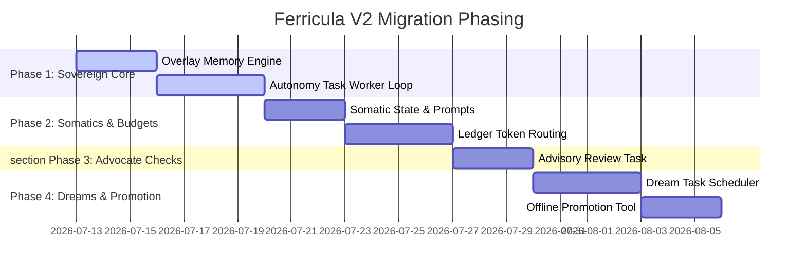

# Roadmap: Vision Parity & Autonomous Migration

This roadmap synthesizes findings from the Gap Audit, Emotion Specification, Memory Spec, Advocate Spec, and Autonomy Spec into a phased execution plan for Ferricula V2.

---

## 1. Phased Migration Plan

### Phase One: Sovereign Autonomous Core (Zero-Mutation Path)
* **Objective**: Smallest path to autonomous reasoning without writing to the legacy base directory.
* **Tasks**:
  1. **Union / Overlay Memory Engine**: Update `crates/ferricula-core/src/persist.rs` to load snapshots/WALs from both `/data/steve-memory/readonly` and `/data/steve-memory/overlay`, merging records by ID in memory.
  2. **Writable Overlay WAL**: Direct all database write operations (WAL appends) to the writeable overlay directory. Legacy files remain read-only.
  3. **Event-Driven Awake Loop**: Expand `TaskKind::ScheduledWake` inside `crates/ferricula-server/src/runtime.rs` to call `deliberate_mention` on feed items, generating self-authored `Disposition` decisions.
* **Dependencies**: None.

### Phase Two: Somatics & Model-Ledger Routing
* **Objective**: Re-introduce budget safeguards and emotional somatic prompt variation.
* **Tasks**:
  1. **Somatic Calculation Lib**: Add somatic calculations (`tension`, `activation`, `groundedness`) to `crates/ferricula-cognition/src/wisdom.rs`.
  2. **Spend Ledger Middleware**: Build an Axum middleware in `crates/ferricula-server/src/api.rs` that counts token costs and substitutes routes dynamically based on daily limits.
* **Dependencies**: Phase One.

### Phase Three: Advisory Advocate Reviews
* **Objective**: Implement values-alignment checks.
* **Tasks**:
  1. **Advisory Review Task**: Add `TaskKind::AdvisoryReview` to the scheduler to evaluate trajectory alignment against values.
  2. **Structured Review Overlay**: Write verdicts to `advisory-history.json` on the write-overlay instead of polluting the semantic memory index.
* **Dependencies**: Phase Two.

### Phase Four: Dream Consolidation & Promotion
* **Objective**: Integrate memory compaction and database promotion.
* **Tasks**:
  1. **Dream Task Integration**: Connect `dream_cycle` inside `crates/ferricula-cognition/src/dream.rs` to the scheduler.
  2. **Offline Promotion Utility**: Build a CLI tool `ferricula-server promote` to merge overlay delta databases into clean, new base snapshots.
* **Dependencies**: Phase Three.

---

## 2. Acceptance Invariants

* **Sovereignty Invariant**:
  * Scheduled wakes and direct mentions can never compel a public action or response without a self-authored `Disposition::Engage` verdict returned from deliberation.
* **Ledger Invariant**:
  * Spend limits must block/substitute model routes *prior* to token consumption.
* **Read-Only Core Invariant**:
  * Legacy files are opened strictly in read-only mode (`:ro`). Overlay WAL is the only sink for runtime state updates.

---

## 3. Behaviors Intentionally Rejected

1. **Plutchik-Locked Model Mappings**: Mappings of emotion directly to vendor strings (e.g. `claude_opus`) are retired in favor of abstract `ModelCapability` profiles.
2. **Deterministic Random Walk transitions**: Random 25% emotion walks are retired; transition shifts must be causally driven by events and decay parameters.
3. **Primary Index Advocate Pollution**: Ingesting advocate self-reflections into the core semantic memory database is rejected. Reviews must sit in a separate operational database.
4. **OS Thread Polling Loops**: Spawning background OS daemon threads that poll state every 45s is rejected. V2 uses tokio async task schedules.

---

## 4. Traceability Table

| Original File / Function | V2 Component / Module | Parity Status |
| :--- | :--- | :--- |
| `steve.py` / `_think_loop()` | `crates/ferricula-server/src/runtime.rs` | Refactored to `run_scheduler` / `run_worker` |
| `steve.py` / `_drifted_model()` | `crates/ferricula-server/src/model_config.rs` | Refactored to declarative fallbacks |
| `steve.py` / `_check_model_heat()` | `crates/ferricula-server/src/model.rs` | Retired |
| `steve.py` / `_update_somatic()` | `crates/ferricula-cognition/src/wisdom.rs` | Scheduled for V2 implementation |
| `steve.py` / `_run_advocate_cycle()`| `crates/ferricula-server/src/runtime.rs` | Scheduled for V2 implementation |
| `memory.rs` / `decay_tick()` | `crates/ferricula-core/src/memory.rs` | Preserved in core crate |
| `dream.rs` / `dream_cycle()` | `crates/ferricula-cognition/src/dream.rs` | Preserved, awaiting runtime scheduler hook |
| `http.rs` / `HttpCommand` | `crates/ferricula-server/src/api.rs` | Refactored to Axum HTTP routing |
